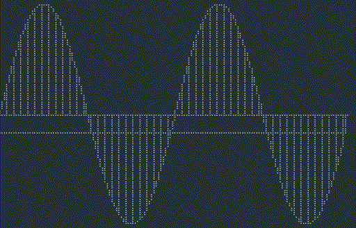

## `drawllie`

[HTML5](https://developer.mozilla.org/en-US/docs/Web/API/Canvas_API) [Canvas](canvas.ts) on the terminal. Based on [Drawllie](https://github.com/asciimoo/drawille) [implementation](drawllie.ts).

